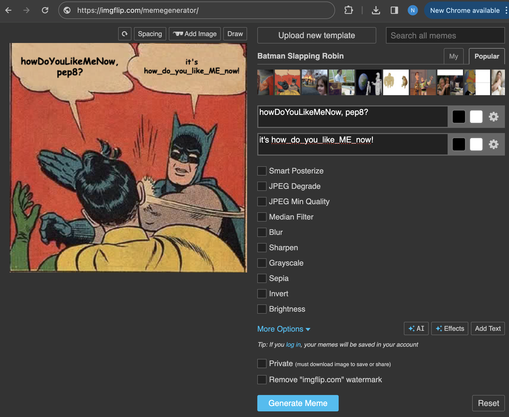

# Meme Generator challenge


In Agile retros we often make and share memes to celebrate or commiserate the events of the recent sprint.

Make something inspired by this:
 - https://imgflip.com/memegenerator

This challenge may benefit from leveraging a gui library:
 - https://www.pygame.org/wiki/gui

You can have pygame load images that you've downloaded to your computer, or you can have pygame download each image for you from a url.
Here's one way to load an image from a url:

```python
import io
import pygame
import requests

r = requests.get(url)
img = io.BytesIO(r.content)
pygame.image.load(img, namehint="")
```

To draw a text box on an image you will want to use the `font.render` function:
- https://www.pygame.org/docs/ref/font.html#pygame.font.Font.render

## Bonus Features:

With this challenge the basics are just displaying an image with some text overlayed on top of it. There are many ways to polish this and make it shine! Are you going to get the text for the meme from calling the `input` function, or are you going to create a dialog box in pygame to capture that text? Are you going to allow your users to choose a font? Are you going to add a drop shadow to the text to make it more legible? So many ways to refine this project!

__BIG Bonus__: Use Dall-E to generate your background image!

Use your inspiring program to make an inspring meme!
